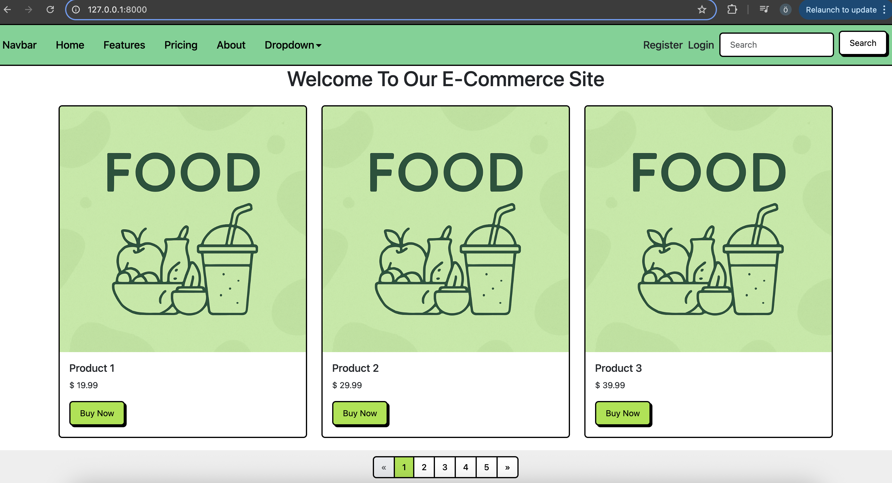

# 🛒 Django E-Commerce Project

Welcome to my e-commerce web app built with **Django**!  
This is a solo learning project where I’m developing a fully functional online store step by step — from user authentication to product management and (soon) payment integration.

---

## 🚀 Features So Far

- ✅ Custom User Model with Email as Username
- ✅ User Registration & Login System
- ✅ Session-based Logout
- ✅ Product Listing with Images
- ✅ Product Add/Edit/Delete via Admin Panel
- ✅ Basic Bootstrap UI

---

## 📂 Project Structure

```
myproject/
├── ecommerce/           # Django project folder
├── users/            # Custom user app
├── products/            # Product app
├── templates/           # HTML templates
├── static/              # Static files (CSS/JS)
├── media/               # Uploaded product images
└── manage.py
```

---

## 🧠 What I'm Learning

This project is not just about building an e-commerce site — it's part of my learning journey in backend development.

- Django Models & Relationships
- User Authentication (with custom user model)
- Form Handling (built-in and custom forms)
- Session & Login Management
- Debugging and Form Validation
- File Uploads & Media Handling
- Deployment (coming soon – AWS/Supabase)

---

## 🧪 How to Run Locally

Clone the repo and set it up in your local environment:

```bash
git clone https://github.com/yourusername/yourrepo.git
cd yourrepo
python -m venv venv
source venv/bin/activate        # Windows: venv\Scripts\activate
pip install -r requirements.txt
python manage.py migrate
python manage.py runserver
```

Then open your browser:  
👉 `http://127.0.0.1:8000`

---

## 📝 To Do (Roadmap)

- [x] User Auth System
- [x] Product Management
- [ ] Shopping Cart & Checkout
- [ ] Payment Integration (Stripe or Iyzico)
- [ ] Order History
- [ ] Kargo API Integration
- [ ] Mobile-Friendly UI
- [ ] Full Deployment

---

## 📸 Screenshots (coming soon)



---

## 🤝 Contributing

This project is for personal learning, but if you want to give feedback or ideas, feel free to open an issue or send a message.

---

## 👤 Author

**Ömer**  
Learning Django, building real-world apps, and having fun with code.  
GitHub: [yourusername](https://github.com/yourusername)
